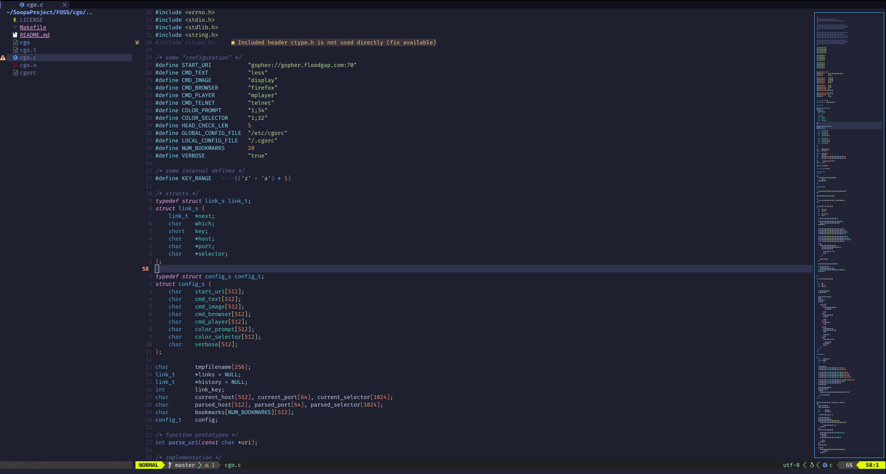

# ThotVim

_No configs, no feelings, just speed._

```bash
❯ nvim --version
NVIM v0.10.4
Build type: RelWithDebInfo
LuaJIT 2.1.1736781742
Run "nvim -V1 -v" for more info

❯ nvim --startuptime startup.log -c exit && tail -5 startup.log
069.360  000.083  000.083: sourcing /home/akuma/.local/share/nvim/lazy/vim-peekaboo/autoload/peekaboo.vim  
069.400  000.155: BufEnter autocommands  
069.401  000.002: editing files in windows  
069.420  000.019: --- NVIM STARTED ---  
```

## Motivation

**ThotVim: The Divine and Questionable Journey**

Thot—**Egyptian god of wisdom and knowledge**—is the perfect namesake for this setup. Why? Because the sheer amount of **research, trial, and tribulation** it took to create this **quick and dirty** Neovim configuration rivals the construction of the pyramids. 🏗️Though, they had great "alien" tech, I on the other hand had only my old dusty laptop.

For **five long years**, I stuck to my trusty **init.vim**, a simple yet effective setup that never betrayed me. Then, one fateful day, I thought:  
*"What if I modernize it? What if I optimize it? What if... I actually try?"*

And thus began my **downward spiral into Lua, plugins, and broken configs**. Countless hours, hundreds of Stack Overflow visits, and at least **three existential crises later**, I present to you: **ThotVim**—a **lightweight, no-strings-attached** Neovim configuration that launches faster than your last relationship ended. 💔🔥

It’s **basic**, it’s **fast**, and it’s **probably all you’ll ever need**—until you get tempted by another Vim plugin and start the cycle all over again. 🚀

### How is it Different?

1. It doesn't tries to do _Everything_
2. It's not a distro, not an operating system. Plain, simple and sane Code Editor.
3. It works with less efforts and more efficiency.

## Requirements

External Requirements:

- Basic utils: `git`, `make`, `unzip`, C Compiler (`gcc`)
- [ripgrep](https://github.com/BurntSushi/ripgrep#installation)
- Clipboard tool (xclip/xsel/win32yank or other depending on the platform)
- A [Nerd Font](https://www.nerdfonts.com/): optional, provides various icons
  - if you have it set `vim.g.have_nerd_font` in `init.lua` to true
- Emoji fonts (Ubuntu only, and only if you want emoji!) `sudo apt install fonts-noto-color-emoji`
- Language Setup:
  - If you want to write Typescript, you need `npm`
  - If you want to write Golang, you will need `go`
  - etc.

## Installation

1. Simply clone the repo in `~/.config/nvim` and Start Neovim the minimum required version is 0.8+,
   However, Best Experience is available on 0.10+ (As its tested by me.)

2. If you simply want to try it out:
   
   ```bash
       git clone https://github.com/Aeres-u99/ThotVim.git ~/.config/testsetup
       # This should start neovim and fetch all of the required plugins
       NVIM_APPNAME=testsetup nvim
       # Cleanup
       ls -altrh ~/.local/share/testsetup
       rm -rf ~/.local/share/testsetup
   ```
   
   ## Features 🔥
* 🛰 **Aerial** for code navigation, 🏷 **Bufferline** for a sleek top bar.
* 🤖 **Coding Assistance**, 🌈 **Rainbow Delimiters**, ✨ Auto Pairing & Indentation.
* 🎨 **Colorizer** for color previews, ⚡ **nvim-cmp** for completions, ✂️ **LuaSnip** for snippets.
* 🖼 **Dashboard** for aesthetics, 🔍 **gitblame** for knowing who messed up your code.
* 🔦 **highlight** for keyword highlighting in logs.
* 📝 **Markdown & Markview** for extra markdown powers.
* 📊 **Lualine** for vital information at a glance.
* 📦 **Mason** for managing completion engines & language servers.
* 🗺 **Minimap**, 🌳 **Nvim Tree** for sane navigation.
* 🔭 **Telescope**, 🖥 **Terminal**, and 🌲 **Treesitter** for better coding experience.
* 🛠 **Quality of Life** plugins, 📌 **vim-mark**, sane defaults, and **much more!** 🚀

## Pull Requests and Support

Please feel free to raise PR

* The setup needs to be fast.

* New comers are welcome 
  
  * ToDo: Create a list of beginner friendly PR

* Feel free to fork and hack upon it!

> [!NOTE]
> Please ensure that the speed is under 100ms. We do not want this to be another bloated all in one neovim configuration

## Screenshots

##### Startup Page


##### Code Editing


##### Code Navigation


##### Themes Demonstration

###### Gruvbox


###### Catpuccin


###### TokyoNight



My Personal Favourite is ayu_night dark with transparency + blur.


## Credits

* https://github.com/neilsabde/nfs

* [GitHub - nvim-lua/kickstart.nvim: A launch point for your personal nvim configuration](https://github.com/nvim-lua/kickstart.nvim)

## ToDo

1. Zen Mode

2. Highlight only the segment I am editing and blur out the rest of code base

3. Mini Buffer + Function Preview

4. Better REPL Support

5. **Find a Magical Potion** – Ideally one that **instantly fixes all my bugs** and **writes perfect code** for me. Or at least something that makes debugging less soul-crushing. 🍷✨
